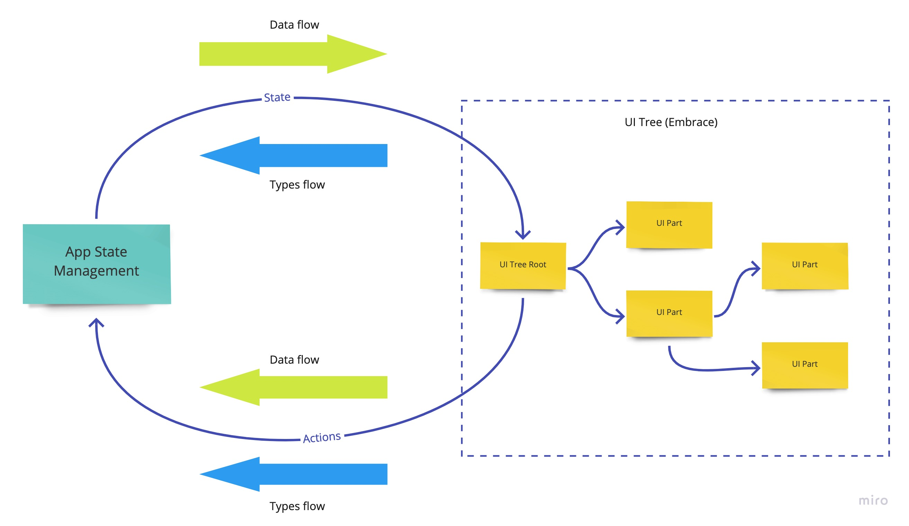

# Embrace

Typesafe, declarative, and composable UI engine on top of [React](https://reactjs.org/) and [Focal](https://github.com/grammarly/focal).

- Detect breaking changes in components with the static type system.
- Clear separation between UI and the logic.
- Build apps with typesafe composition.
- Transform a section of the UI composition without the need to reconstruct the whole composition.

## Quick Example

```ts
import * as React from 'react'
import * as ReactDOM from 'react-dom'
import { EMPTY } from 'rxjs'
import * as Rx from 'rxjs/operators'
import { F } from '@grammarly/focal'
import { Flow, UI } from '@grammarly/embrace'

/**
 * Page layout that defines slots for header and body components.
 * Should be composed with `Header` and `Body` upon mount (see `UI.Knot.make` below)
 * <Grid>
 *   <Header>
 *   <Body>
 * </Grid>
 */
const mainGrid = UI.Grid.make<'header' | 'body'>(({ slots }) => (
  <div className="main">
    {slots.header}
    {slots.body}
  </div>
))

// Body component. Consume state, doesn't emit any events
const Body = UI.Node.make<{ readonly content: string }, never>(({ state }) => (
  <F.main className="body">{state.pipe(Rx.map(({ content }) => content))}</F.main>
))

// Flow with an initial value of the `Body` state
export const bodyFlow: Flow.For<typeof Body> = Rx.startWith({ content: 'Hello, World!' })

// Header component. Neither consumes state nor emits events
const Header = UI.Node.make(() => <header className="header">Welcome</header>)

// Produce a component by composing `mainGrid` with `Header` and `Body`
export const Main = UI.Knot.make(mainGrid, { header: Header, body: Body })

// Flow for a `Main` component. Created by the composition of the `bodyFlow` with the custom flow for the Header
const mainFlow: Flow.For<typeof Main> = Flow.composeKnot<typeof Main>({
  header: () => EMPTY,
  body: bodyFlow
})

// Create a React component by composing `Main` component with `mainFlow`
const App: React.FC = () => UI.mount(Main, mainFlow)

ReactDOM.render(<App />, document.getElementById('root'))
```

Example of another app with a different header:

```ts
import * as React from 'react'
import * as ReactDOM from 'react-dom'
import { flow, pipe } from 'fp-ts/lib/function'
import * as Rx from 'rxjs/operators'
import { F } from '@grammarly/focal'
import { Flow, UI } from '@grammarly/embrace'
import { bodyFlow, Main } from './'

// A different version of the `Header` component. Consumes state, can emit `onClick` event
const CustomHeader = UI.Node.make<{ readonly user: string }, 'onClick'>(({ state, notify }) => (
  <header className="header">
    <F.span>{state.pipe(Rx.map(({ user }) => `Hello, ${user}`))}</F.span>
    <button onClick={notify('onClick')}>Button</button>
  </header>
))

// `CustomHeader` logic (Flow). Contains actions handler and initial value
const customHeaderFlow: Flow.For<typeof CustomHeader> = flow(
  Rx.map(() => ({ user: 'username' })),
  Rx.startWith({ user: 'anonymous' })
)

// Produce a different version of the `Main` component by replacing the header
const NewMain = pipe(
  Main,
  UI.patch('header')(() => CustomHeader)
)

// Flow composition for the new `NewMain` version. Constructed by using the old `bodyFlow` and the new `customHeaderFlow`
const newMainFlow: Flow.For<typeof NewMain> = Flow.composeKnot<typeof NewMain>({
  header: customHeaderFlow,
  body: bodyFlow
})

// Create a React component by composing `NewMain` component with `newMainFlow`
const App: React.FC = () => UI.mount(NewMain, newMainFlow)

ReactDOM.render(<App />, document.getElementById('root'))
```

## Project Status

Embrace is an experimental prototype. Breaking changes may occur up to 1.0.0 release.

## WHY?

With applications growing with features and code-base, more and more developers are looking for ways to re-use the code between them.
The popular solution is to extract shared code to the components library.
While this approach does solve the scaling problem, it also adds challenges:

- **It is hard to customize existing shared components**: components tend to stick with the design of the original app in which they were initially created. As a result, it is very hard to customize and re-use them in other apps. In most cases, customization requires a partial or total component redesign.
- **No easy way to detect breaking changes**: each React component could potentially have an unlimited amount of state management logic that is not visible through its props types. Heavy usage of such React APIs as `context` only makes things worse. As a result, a change to a platform component could break some of its (many) clients, especially if a client had customized a library's component behavior.
- **Adding new experiments increases the complexity of the UI code**: every running experiment adds one or more branches into an already complex UI logic. As the number of experiments grows, the complexity increases in a non-linear way.

## WHAT?

Main ideas behind Embrace:

- **Use static typing to manage breaking changes**: it should not be possible to change the component behavior without changing its type. I.e., both the state component uses and actions it can trigger must be part of its strongly-typed interface. Furthermore, using a new version of the library's component with a breaking change should result in a compilation error.
- **Enforce UI components not to have state management logic**: there should be a clear separation of UI and App State logic. UI components should only be allowed to trigger strongly-typed actions, i.e., an "intent" that must be handled by some other state management module. Not having such clear separation makes it hard to re-use components, as different apps usually have different means to manage their state.
- **Allow centralized UI customizations**: it should be possible to collocate all UI changes (driven by an experiment or library-using app customization) in one place. I.e., the complexity of a UI code should grow linearly (or logarithmically in the worst-case scenario) with the number of customizations.
- **Minimize time spent on experiments cleanup**: centralized UI customization means that it should be possible to enumerate all active experiments or other UI customizations. Therefore, removing an experiment should be as easy as deleting an item from the list.
- **Minimize time spent on code reviews**: with all the constraints above, the new UI building approach should minimize the number of possible ways to implement a new feature, making it easier to accept changes from contributors.

## HOW?

The Embrace library should implement all of the requirements above. The idea behind it is simple: define UI Tree as a function from a stream of state changes to a stream of actions, with a side-effect of UI rendering:



UI Tree accepts state changes as they happen, triggering re-render of corresponding React components, and emits actions as they are triggered by the user or some other UI event.
As a result, we get a "classic" UI cycle where data flows one way (from "machine" to "UI"), and actions flow the opposite way. The innovation is in the implementation:

- it forces immutability and type safety on the UI Tree
- it makes the UI Tree representation truly declarative (see `Patching UI Tree` section below)
- it does not rely on React's VDOM and instead triggers a re-render of affected components using [wormholes pattern](https://www.danwc.com/data/Winograd-Cort-Wormholes.pdf) implemented using RxJS observables and Focal React.

As of now, Embrace _does not_ dictate how the state management part is implemented. It only provides a set of useful types and helper functions to compose a larger UI Tree from smaller parts in a type-safe way:

The basic building block of Embrace is `UIPart`:

```ts
interface MountProps<State, Action, Slots extends PropertyKey> {
  readonly children: Record<Slots, React.ReactNode | Observable<React.ReactNode>>
  readonly state: Observable<State>
  notify(i: Action): void
}

interface UIPart<State, Action, Slots> {
  (props: MountProps<State, Action, Slots extends PropertyKey ? Slots : never>): React.ReactElement<
    any,
    any
  >
}
```

UIPart accepts an Observable of `State`, notifies of new `Actions` and can also have `Slot`s, which are placeholders for another UIPart.

UIPart cannot modify app's state directly (e.g., by having a reference to a view model or some other shared state), it can only trigger an `Action`, which may (or may not) result in a new `State` passed to UIPart.

The job of a programmer using Embrace is to compose the entire UI tree out of smaller parts so that the final tree is represented by a single UIPart, with a `State` type representing the whole app state tree, the `Action` type containing all possible actions triggered by the app (again, in the form of a tree), and with no empty `Slots`.

To render UIPart, you need to "mount" it, by providing a `Flow`:

```ts
export function mount<Node extends UIAny>(
  uiNode: Node,
  uiFlow: Flow<ComposedAction<Node>, ComposedState<Node>>
): React.Element {
  ...
}
```

You can think of a Flow as a function from actions to state, where both actions and state are observables.
Hence, the actions stream "flows" and turns into a state changes stream.

Once mounted, UI Tree becomes a regular React Element that can be rendered.

UI Tree can also be "squashed" using `UI.squash` function, which will collapse all nesting in a Tree's state and actions type info and turn the Tree into a single Node (see below).
It is important to understand that while squashing may be helpful to deal with complex trees, after using it, we lose the possibility to change the Tree later (see `Patching UI Tree` section below)

**Examples**:

A simple Node that renders text and can be clicked:

```tsx
import { UI } from '@grammarly/embrace'

type State = string
type Actions = 'nodeClick'

/**
 * This component can be rendered if the state, a string in this case, is provided.
 * It's also can emit actions, in this example - only one action of the type `nodeClick`.
 */
const node = UI.Node.make<State, Actions>(({ state, notify }) => (
  <F.div onClick={notify('nodeClick')}>{state}</F.div>
))
```

To mount the Node, we need to provide a flow:

```ts
// here we echo any action triggered by node as its state
// IMPORTANT: since Embrace state is cold, we always need to provide an initial state, otherwise component will not be rendered
const echoingFlow = Rx.startWith('initial text')
// the component will render 'initial text' first, 'nodeClick' will be rendered after the first click
const element: React.Element = UI.mount(node, echoingFlow)

const discardingFlow = flow(
  Rx.map(() => 'foo'),
  Rx.startWith('initial text')
)
// the component will render 'initial text' first, 'foo' wil be rendered after the first click
const element2: React.Element = UI.mount(node, discardingFlow)
```

A mandatory counter example:

```tsx
const counter = UI.Node.make<number, 'plus' | 'minus'>(({ state, notify }) => (
  <F.div>
    <button onClick={notify('minus')}>-</button>
    {state}
    <button onClick={notify('plus')}>+</button>
  </F.div>
))

const element = UI.mount(
  counter,
  flow(
    Rx.scan((acc, a) => (a === 'plus' ? acc + 1 : acc - 1), 0),
    Rx.startWith(0)
  )
)
```

### Composing UI Parts together

Embrace uses raw UIPart to build a few higher-level abstractions to help build the UI Tree (in fact, UIPart is currently not exported from Embrace, which means you will not use UIPart but instead primitives described below).

- **Node**: the most basic part of UI. Renders UI according to passed State and emits Actions as side-effects from interactions with UI. Node cannot have slots:
  ```ts
  interface Node<State, Action> extends UIPart<State, Action, never> {}
  ```
- **Grid**: a visual component, same as `Node`, but has named `Slots` that should be filled with other UIParts, as a way to provide extensibility
  ```ts
  interface Grid<State, Action, Slots> extends UIPart<State, Action, Slots> {}
  ```
- **Knot**: a composition of a `Grid` with other `UIParts`, can be used to fill `Grid`'s Slots with specific UIParts
  ```ts
  interface Knot<State, Action, Children extends Record<string, UIAny>> {
    readonly grid: UI.Grid<State, Action, keyof Children>
    readonly children: Children
  }
  ```
- **Composite**: a special case of a `Knot` for a constant `Grid` (`State` & `Actions` is `never`). Composite does not have its own `State` or `Actions`, but it lift up `State` & `Actions` of the child, allowing to create a static wrappers
  ```ts
  interface Composite<Child extends UIAny> {
    readonly grid: UI.Grid<never, never, any>
    readonly child: Child
  }
  ```
- **Group**: a special case of a `Knot`, where a `Grid` layout is represented by a Fragment. Can be used to group several `UIPart`s when an explicit layout is not needed:
  ```ts
  interface Group<Children extends Record<string, UIAny>> extends Knot<never, never, Children> {}
  ```
- **List**: Represents a collection of `UIPart`s with dynamic size:
  ```ts
  interface List<
    F extends URIS | URIS2,
    Foldable extends FoldableWithIndex1<F, any> | FoldableWithIndex2C<F, any>,
    Children extends UIAny
  > {
    readonly foldable: Foldable
    readonly of: Children
  }
  ```
- **Union**: Represents a choice of `UIPart`s that dynamically renders one of the provided Members based on Tag. Where Tag value is coming from the State of UI Tree. It can be used to represent a dynamic branching in UI Tree.
  ```ts
  export interface Union<Tag extends string, Members extends Record<string, UIAny>> {
    readonly tag: Tag
    readonly members: Members
  }
  ```

**Example**:
Let's create a simple app with a header containing navigation and a body:

```tsx
// our app is a Grid that has header and body slots
const appGrid = UI.Grid.make<'header' | 'body'>(({ slots }) => (
  <F.Fragment>
    {slots.header}
    {slots.body}
  </F.Fragment>
))

// Header is a Grid that has nav slot
const headerGrid = UI.Grid.make<'nav'>(({ slots }) => (
  <F.div>
    'Welcome'
    {slots.nav}
  </F.div>
))

// nav using buttons, note that it does not have any state
const buttonNav = UI.Node.make<never, 'navClick'>(({ notify }) => (
  <button onClick={notify('navClick')}>Navigate</button>
))

// simple body that renders given string state, note that it cannot trigger any actions
const body = UI.Node.make<string, never>(({ state }) => <F.div>{state}</F.div>)

// header with a nav button
const header = UI.Knot.make(headerGrid, { nav: buttonNav })

// default app users header with a button nav and a string body
const app = UI.Knot.make(appGrid, {
  header,
  body
})
```

In Embrace, a "higher-level" UIPart composed from smaller UIParts has its type as a composition of child UIParts' types:

```tsx
// a type signature of the `app` from the above example:
const app: UI.Knot<
  never,
  never,
  {
    header: UI.Knot<
      never,
      never,
      {
        nav: UI.Node<never, 'navClick'>
      }
    >
    body: UI.Node<string, never>
  }
>

// the type of the "actions" input of the app's flow function:
Observable<{
    key: "header";
    action: {
        key: "nav";
        action: "navClick";
    };
}>

// the type of the app's flow output:
{ header: {}; body: string; }
```

You can also see more detailed usage scenarios in the Embrace test specifications.

### Patching UI Tree

Patching allows changing a small piece of the UI composition without the need to re-compose the whole UI. This could be useful if you are re-using the UI portion but want to change a small part of it.
The alternative to patching is to fork the original UI. However, forking requires maintaining the two versions of the UI composition.

Patching is very useful if the UI has several versions. For example, there might be a need to release two versions of the same UI to see how the users will react to each of those. This approach is known as A/B experiments.

Embrace UI Tree can be thought of as a nested map of UIParts, where any node of a tree (i.e., any UIPart at any map path) can be altered to produce a new version of the UI Tree. So it is possible to write a function that takes one complex UI Tree as input and produces another modified UI Tree as output.

**Example**:

```ts
// a custom nav that uses links instead of buttons
const aNav = UI.Node.make<never, 'navClick'>(({ notify }) => (
  <a onClick={notify('navClick')}>Navigate</a>
))

// customized app here has the same type as default app since types of `buttonNav` and `aNav` are the same
// however, if we replace the node with another node that have different type of state or actions,
// the resulting app type will also change
const appWithCustomNav = pipe(
  app,
  UI.patch('header', 'nav')(() => aNav)
)
```

If we define experiments as such functions, it becomes possible to represent all active experiments for a user as a list of such 'patch' functions. We can then apply these functions to a default UI Tree to get customized UI with experiments:

```ts
const replaceNavExperiment = flow(UI.patch('header', 'nav')(() => aNav))
const anotherExperiment = ...
const experiments = [replaceNavExperiment, anotherExperiment]

const appForUser = experiments.reduce((a, e) => e(a), app)

```

Now, adding or removing an experiment will result in changing the list of patch functions, and all experiments could be managed in one place.

Modified UI Tree can re-use `Flow` of the original components with modifications.

Let's say we have the following components:

```ts
import { UI } from '@grammarly/embrace'

declare const Header: UI.Node<
  { readonly title: boolean; readonly color: string },
  'hover' | 'unhover'
>
declare const Footer: UI.Node<{ readonly link: boolean }, 'click'>

declare const App: UI.Knot<
  { readonly content: string },
  'scroll',
  {
    readonly header: typeof Header
    readonly footer: typeof Footer
  }
>

export { Header, Footer, App }
```

and the `Flow` for it:

```ts
import { Flow } from '@grammarly/embrace'
import { App, Footer, Header } from './app_ui'

declare const HeaderFlow: Flow.For<typeof Header>
declare const FooterFlow: Flow.For<typeof Footer>
declare const ContentFlow: Flow<'scroll', { readonly content: string }>
declare const AppFlow: Flow.For<typeof App>

export { AppFlow }
```

Here`s a couple of use cases of how we can change it but still re-use some code:

<details>
<summary>1. We do not need a footer, and we need to remove it from UI.</summary>

```ts
import { pipe } from 'fp-ts/lib/pipeable'
import { Flow, UI } from '@grammarly/embrace'
import { AppFlow } from './app_flow'
import { App } from './app_ui'

const AppWithoutFooter = pipe(
  App,
  UI.patch('footer')(() => UI.Node.empty) // replace footer with empty node
)

export const flow: Flow.For<typeof AppWithoutFooter> = pipe(
  AppFlow,
  // map a state from `{ root: { content: string }, header: { title: string, color: string }, footer: { link: string }}`
  // to `{ root: { content: string }, header: { title: string, color: string }`
  Flow.patchState(
    Rx.map(oldState => ({ root: oldState.root, increment: oldState, header: oldState.header }))
  )
  // we can keep an actions handlers of the old flow because `footer` node will not produce any actions
)
```

</details>
<details>
<summary>2. We have a completely different header. Can we re-use logic of the body and footer?</summary>

```ts
const NewHeader: UI.Node<{ text: string }, 'onClick' | 'onHover'>
const NewApp = pipe(
  App,
  UI.patch('header')(() => NewHeader) // replace header with a different node
)

// It is not possible to mutate a part of the actions stream, instead we will create a new one from the smaller parts
const flow: Flow.For<typeof NewApp> = Flow.composeKnot<typeof NewApp>({
  // footer and root part did not change, re-use their flow
  root: ContentFlow,
  footer: FooterFlow,
  // re-implement header flow
  header: flow(
    Rx.scan(
      (prevState, action) => {
        if (action === 'onClick') {
          return { text: 'bar' }
        }
        return prevState
      },
      { text: 'foo' }
    )
  )
})
```

</details>

<details>
<summary>3. Hover action, emitted when the 'Shift' button is pressed, should change title color to green instead of red.</summary>

```ts
declare const App: UI.Knot<
  { content: string },
  'scroll',
  {
    header: UI.Node<{ title: boolean; color: string }, 'hover' | 'unhover'>
    footer: UI.Node<{ link: boolean }, 'click'>
  }
>

const shiftPress: Observable<boolean> = fromEvent(window.document, 'keydown').pipe(
  Rx.map(e => e.shiftKey === true),
  Rx.merge(fromEvent(window.document, 'keyup').pipe(Rx.mapTo(false)))
)

// It is not possible to mutate a part of the actions stream, instead we will create a new one from the smaller parts
const flow: Flow.For<typeof App> = Flow.composeKnot<typeof App>({
  // footer and root part did not change, re-use their flow
  root: ContentFlow,
  footer: FooterFlow,
  // re-implement header flow
  header: flow(
    Rx.withLatestFrom(shiftPress),
    Rx.scan(
      ([prevState, isShiftPressed], action) => {
        if (action === 'hover') {
          return { title: prevState.title, color: isShiftPressed ? 'green' : 'red' }
        } else {
          return { title: prevState.title, color: 'black' }
        }
      },
      { title: 'foo', color: 'black' }
    )
  )
})
```

</details>

<details>
<summary>4. Click on the footer link should trigger additional request</summary>

```ts
declare const App: UI.Knot<
  { content: string },
  'scroll',
  {
    header: UI.Node<{ title: boolean; color: string }, 'hover' | 'unhover'>
    footer: UI.Node<{ link: boolean }, 'click'>
  }
>

// If we are ok with the default actions and state, we can re-use original flow and extend it with additional handler
const flow: Flow.For<typeof App> = pipe(
  AppFlow,
  Flow.extendActions(
    Rx.tap(actions => {
      if (actions.key === 'footer' && actions.action === 'click') {
        sideEffect()
      }
    })
  )
)
```

</details>
<details>
<summary>5. We do not need content to be scrollable</summary>

```ts
declare const App: UI.Knot<
  { content: string },
  'scroll',
  {
    header: UI.Node<{ title: boolean; color: string }, 'hover' | 'unhover'>
    footer: UI.Node<{ link: boolean }, 'click'>
  }
>

// It is not possible to mutate a part of the actions stream, instead we will create a new one from the smaller parts
const flow: Flow.For<typeof App> = Flow.composeKnot<typeof App>({
  // header and footer did not change, re-use their flow
  header: HeaderFlow,
  footer: FooterFlow,
  // re-implement root flow
  root: pipe(
    ContentFlow, // we can re-use root state
    Flow.replaceActions(Rx.switchMap(() => NEVER)) // change action handler to unsubscribe from the scroll
  )
})
```

</details>

<details>
<summary>6. We need to create a list of footers. In terms of UI, it is just wrapping Footer into UI.List. How can we re-use FooterFlow here?</summary>

```ts
const AppWithListOfFooters = pipe(
  App,
  UI.patch('footer')(footer => UI.List.make(R.record, footer)) // replace footer with list of footers
)
```

</details>
<details>
<summary>7. We need to create a dynamic list of app content, each section should have a 'remove' button, and the list itself has an 'add' button. Is it possible to re-use here result from case 4?</summary>

```ts
const RemoveButton = UI.Node.make<never, 'onClick'>(({ notify }) => (
  <button onClick={notify('onClick')}>Remove</button>
))
const AddButton = UI.Node.make<never, 'onClick'>(({ notify }) => (
  <button onClick={notify('onClick')}>Add</button>
))
const ContentLayout = UI.Grid.make<'removeButton', { content: string }, 'scroll'>(
  ({ slots, view, notify }) => (
    <F.div onScroll={notify('scroll')}>
      {view('content')}
      {slots.removeButton}
    </F.div>
  )
)
const Content = UI.Knot.make(ContentLayout, { removeButton: RemoveButton })

const AppLayout = UI.Grid.make<'addButton' | 'list'>(({ slots }) => (
  <div>
    {slots.list}
    {slots.addButton}
  </div>
))
const App = UI.Knot.make(AppLayout, {
  addButton: AddButton,
  list: UI.List.make(A.array, Content)
})
```

</details>

## Differences from react-redux model

When using `redux`, we often tend to de-compose the app state from top to bottom. I.e., we define a "reducer" for some part of the app state, then "connect" a top-level component to listen to state changes, and then pass data coming from the connected state to child components via props when needed.

In Embrace, however, the state composition happens "from bottom to top", which guarantees the type safety of a final UI Tree's state. I.e., any change to a type of any UIPart's state at any level of a UI tree (or a change to the way different parts are composed together) will lead to a change of a final UI tree state type. In this case, a client code (which mounts final UIPart by providing a flow) will not compile. It also makes it possible to alter (patch) the UI Tree before mounting, whereas it is possible to do in a type-safe way using the "top to bottom" approach.

The same applies to the types of actions.

## Differences from Focal model

Embrace, and Focal's main difference is that Focal atoms are hot, while Embrace uses cold observables to represent both state and actions.

While Embrace uses Focal UI abstractions when rendering UI nodes, it does not promote Focal atoms to manage the app state.

## Relation to category theory

If we think of UI Tree as a function from states to actions:

```
s0 -> (ui) -> a0
```

Then the `s0` and `a0` types become more complex as we develop the `ui`. The examples above show how `State` and `Actions` types are composed of corresponding `UIPart`s "input" states and "output" actions.

To deal with this composition in a more controlled manner, when designing parts of UI Tree, it may be helpful in to "pre-process" (or _contramap_) states and "post-process" (or _map_) actions:

```
s1 -> s0 -> (ui) -> a0 -> a1
```

Or, continuing our "app" example:

```tsx
const buttonNav = pipe(
  UI.Node.make<never, 'navClick'>(({ notify }) => (
    <button onClick={notify('navClick')}>Navigate</button>
  )),
  // add more semantics to or transform (post-process) the action
  UI.mapAction(v => ({ navAction: v }))
)

const body = pipe(
  UI.Node.make<string, never>(({ state }) => <F.div>{state}</F.div>),
  // add more semantics or transform (pre-process) the state
  UI.contramapState((s: { welcomeText: string }) => s.welcomeText)
)

// our new app:
const app: UI.Knot<
  never,
  never,
  {
    header: UI.Knot<
      never,
      never,
      {
        nav: UI.Node<
          never,
          {
            navAction: 'navClick'
          }
        >
      }
    >
    body: UI.Node<
      {
        welcomeText: string
      },
      never
    >
  }
> = UI.Knot.make(appGrid, {
  header: UI.Knot.make(header, { nav: buttonNav }),
  body
})
```

Both `mapAction` and `contramapState` are implemented using `promap` function, which obeys the `profunctor` laws.

## Caveats

- While Embrace makes UI more type-safe and allows making changes in a more controlled way, it does not protect us from logical errors, i.e., it is still possible to make a change that will make the compiler happy but will result in a runtime error. Thus, even though the risk of breaking stuff should be lower when using Embrace, we still need e2e tests.
- It is possible to bypass Embrace strong type guarantees by wrapping an existing React component using `make` API. In this case, Embrace will only provide guarantees about "external" component API, while its internals could contain any behavior. Therefore the amount of value we get from using Embrace grows with the number of components implemented as "pure" functions from states to actions.
- The primary use-case for the `patch` function is to alter UI Tree at app init (e.g., apply active experiment changes). Using the `patch` function at runtime will require re-mounting the entire UI Tree and should be used cautiously.

## Restrictions

- To work in old browsers (IE11, Safari <10), Embrace require the following polyfills:
  - [Proxy](https://developer.mozilla.org/en-US/docs/Web/JavaScript/Reference/Global_Objects/Proxy)

## Embrace was influenced by:

- http://xreact.oyanglul.us/
- https://github.com/xaviervia/react-dream
- https://github.com/hoppinger/MonadicReact
- https://github.com/sharkdp/purescript-sparkle
- https://github.com/reflex-frp/reflex-dom

## License

Copyright 2021 Grammarly, Inc.

Licensed under the Apache License, Version 2.0 (the "License");
you may not use this file except in compliance with the License.
You may obtain a copy of the License at

    http://www.apache.org/licenses/LICENSE-2.0

Unless required by applicable law or agreed to in writing, software
distributed under the License is distributed on an "AS IS" BASIS,
WITHOUT WARRANTIES OR CONDITIONS OF ANY KIND, either express or implied.
See the License for the specific language governing permissions and
limitations under the License.
